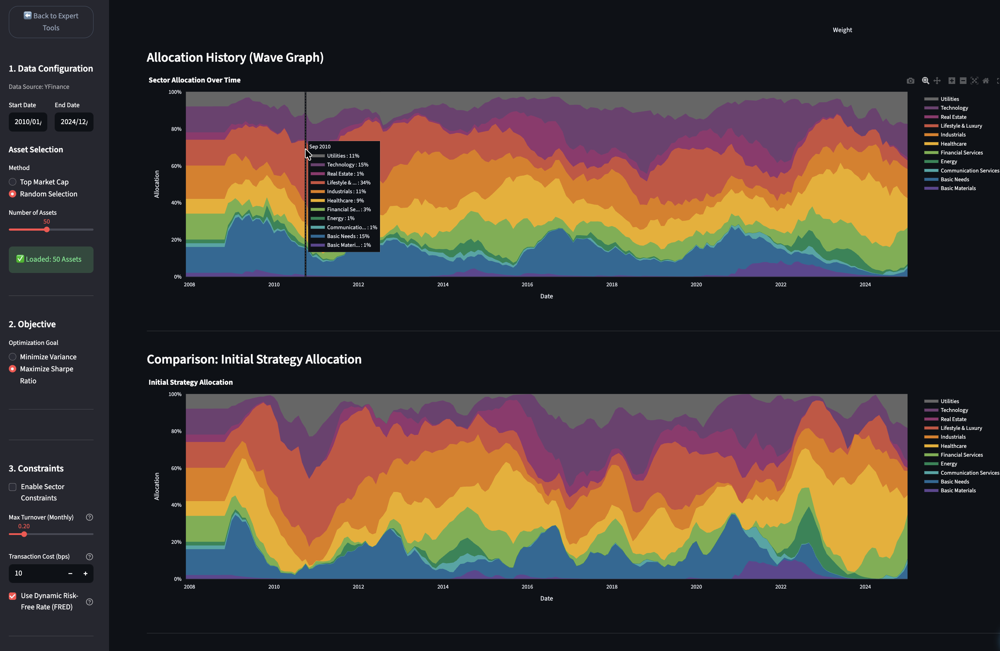
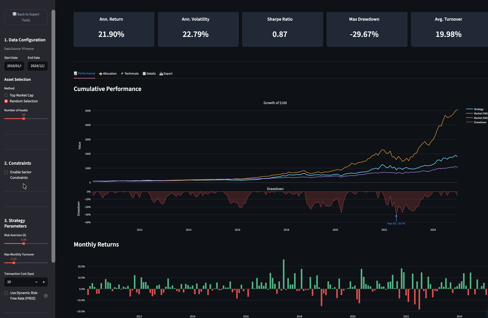
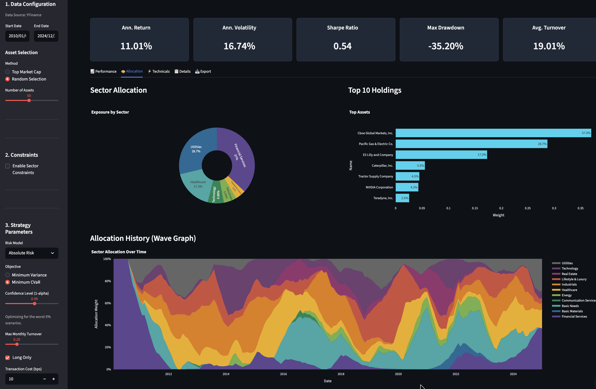
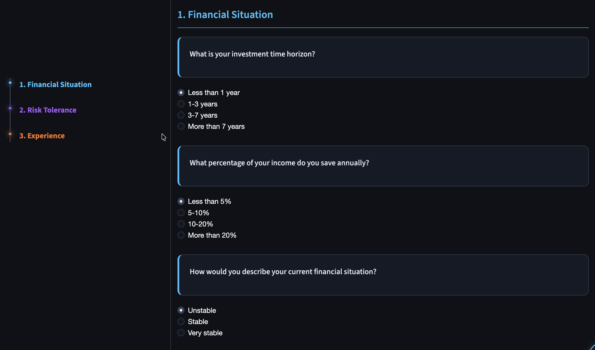
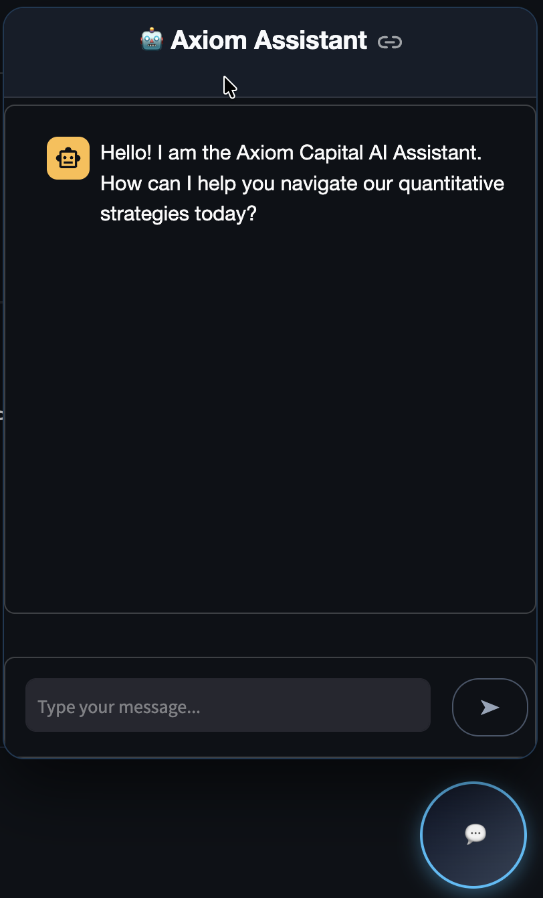

# Axiom Capital - Quantitative Asset & Risk Management Platform

Axiom Capital is a quantitative investment platform designed to bridge the gap between institutional-grade finance and accessible wealth management. It integrates portfolio optimization engines, risk management frameworks, and a curated selection of investment strategies.


<div align="center">

[](https://axiom-capital.streamlit.app)
[](https://www.python.org/)
[](LICENSE)

</div>

## Platform Preview


### Michaud Resampling

The engine performs Monte Carlo simulations to mitigate estimation errors, visualizing sector stability through wave charts.




### User Experience & Expert Modules
<div align="center">

| **Utility Optimization** | **Risk Architecture** |
|:---:|:---:|
|  |  |
| *Maximize CRRA Utility with custom Risk Aversion (λ)* | *Deep risk breakdown (ERC) & Constraints* |

| **Automated Advisory** | **AI Assistant** |
|:---:|:---:|
|  |  |
| *Guided profiling and automated portfolio construction* | *Context-aware QARM-Bot analyzing live results* |

</div>

## Project Architecture

```ascii
axiom-capital/
├── app.py                  # Main Application Entry Point
├── requirements.txt        # Python Dependencies
├── pages/                  # Streamlit Application Pages
│   ├── index.py            #    - Main Dashboard & Navigation
│   ├── landing.py          #    - Landing Page
│   ├── experts/            #    - Expert Tools (Frontier, Risk, Utility)
│   ├── novice/             #    - Novice User Flows (Questionnaire)
│   └── products/           #    - Individual Product Detail Pages
├── src/                    # Core Logic & Source Code
│   ├── components/         #    - UI Components (Chatbot, Charts)
│   ├── portfolio_engine/   #    - Optimization Engines
│   └── products/           #    - Product Definitions & Metadata
├── data/                   # Data Storage
│   └── yfinance/           #    - Market Data (YFinance)
└── scripts/                # Utility & Maintenance Scripts
```

## Key Features

### 1. Expert Tools
A suite of quantitative tools for portfolio construction and analysis:
*   **Efficient Frontier**: Visualization of the risk-return trade-off.
*   **Risk Analysis**: Detailed risk metrics including Value at Risk (VaR) and stress testing.
*   **Utility View**: Analysis of investor utility functions and optimal allocation.

### 2. Investment Strategies
Implementation of various portfolio allocation strategies:
*   **Defensive**: Strategies focused on capital preservation (e.g., Minimum Variance).
*   **Balanced**: Strategies balancing growth and risk (e.g., Risk Parity, Maximum Sharpe).
*   **Aggressive**: Strategies targeting higher returns.
*   **ESG Impact**: Portfolios constructed with sector-based ESG constraints.

### 3. Intelligent Assistance
*   **AI Chatbot**: A context-aware assistant powered by OpenAI to facilitate platform navigation and explain financial concepts.

## Technical Overview

### Optimization Engine
The platform utilizes **CVXPY** for convex optimization with a solver-agnostic architecture.
*   **Primary Solver**: Defaults to **CLARABEL** (open-source) for broad compatibility and robust performance.
*   **Commercial Solvers**: The architecture is designed to support **MOSEK** and **GUROBI** for large-scale industrial problems, automatically detecting available licenses for enhanced stability.

### Data
The platform currently relies on **YFinance** for market data acquisition. The architecture is designed to support additional data sources.

### Prerequisites
*   Python 3.10+
*   [Optional] MOSEK License

### Installation

1.  **Clone the repository**
    ```bash
    git clone https://github.com/jeyllani/axiom-capital.git
    cd axiom-capital
    ```

2.  **Install dependencies**
    ```bash
    pip install -r requirements.txt
    ```

3.  **Run the application**
    ```bash
    streamlit run app.py
    ```

## Technology Stack
*   **Frontend**: Streamlit
*   **Data Processing**: Pandas, NumPy, Polars
*   **Optimization**: CVXPY, Riskfolio-Lib
*   **Visualization**: Plotly, Matplotlib, Seaborn
*   **AI**: OpenAI GPT-4o

## License
This project is licensed under the MIT License - see the [LICENSE](LICENSE) file for details.

## Authors

*   **Abdul Kadir Jeylani Bakari**
*   **Arnaud Küffer**
*   **Stella Marinelli**
*   **Yannick Travasa**

---

### 🎓 Academic Context

**HEC Lausanne - The Faculty of Business and Economics**
*MSc in Finance | Quantitative Asset & Risk Management (QARM)*

**Supervised by:**
Prof. Marc-Aurèle Divernois

## ⚖️ Data Limitations & Academic Honesty

### Survivorship Bias
This project currently utilizes **YFinance** as its primary data source. Consequently, the historical analysis is subject to **survivorship bias**, as it only includes assets currently listed on exchanges. Companies that went bankrupt or were delisted during the backtest period (2008-2024) are excluded.
*   *Impact*: Historical returns may be slightly overstated, and volatility understated.
*   *Mitigation*: The "Universe Selection" module includes a liquidity filter to ensure only tradeable assets are selected, but the bias remains inherent to the data source.

### Lookback Period
The analysis starts in **2010**, using a **24-month lookback window** (data from 2008) to initialize covariance matrices. This "warm-up" period ensures that the first point on the chart (Jan 2010) is mathematically rigorous, based on 2 years of prior volatility history.

## ⚠️ Disclaimer

This project is for **educational and academic purposes only**. It does not constitute financial advice, investment recommendations, or an offer to sell securities. The optimization models (Markowitz, Risk Parity) are based on historical data, which is not a guarantee of future returns. 

**Axiom Capital** is a fictional entity created for the QARM Master's course at HEC Lausanne.